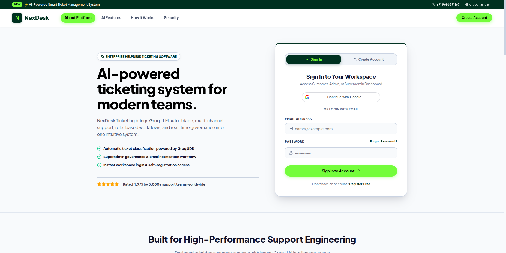
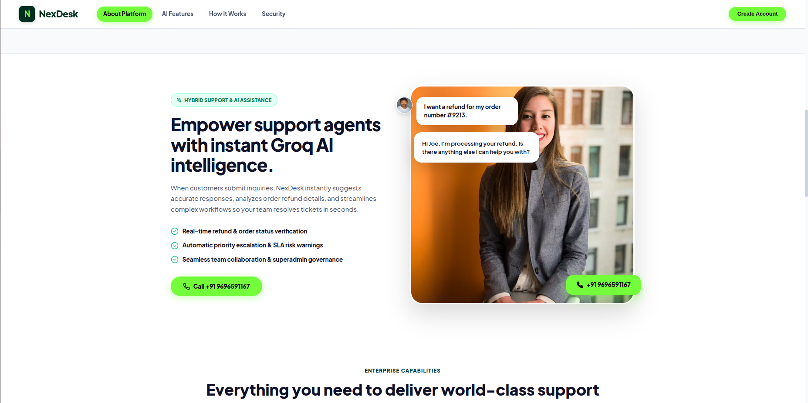
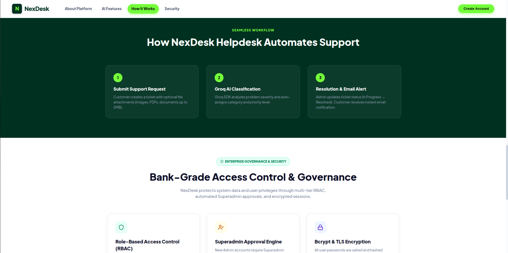
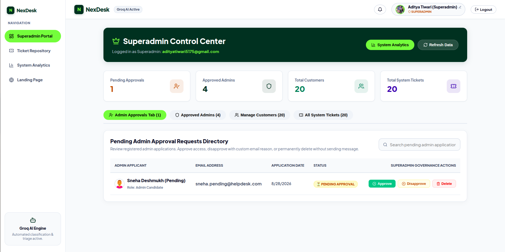
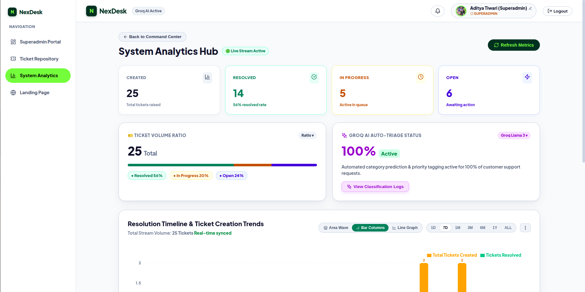
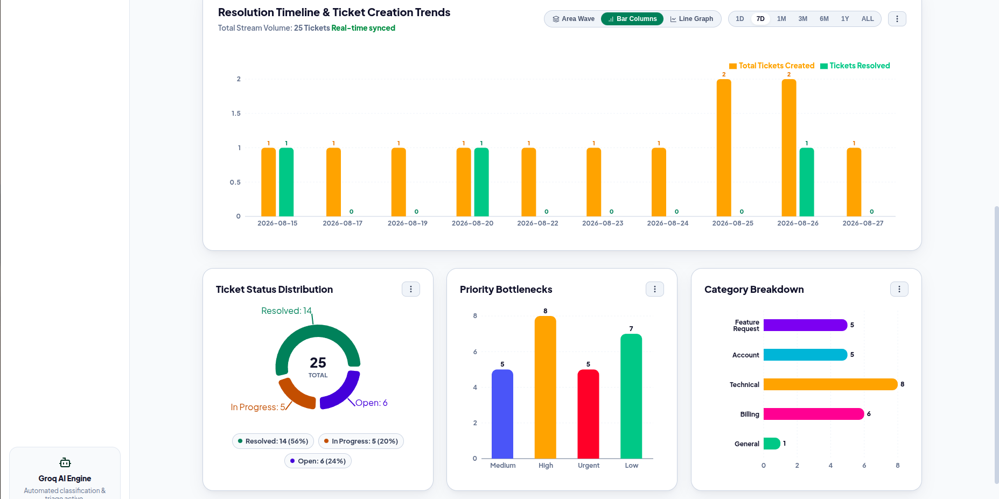
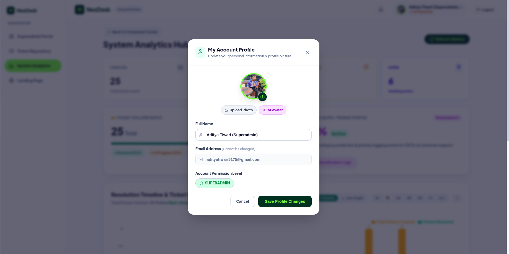
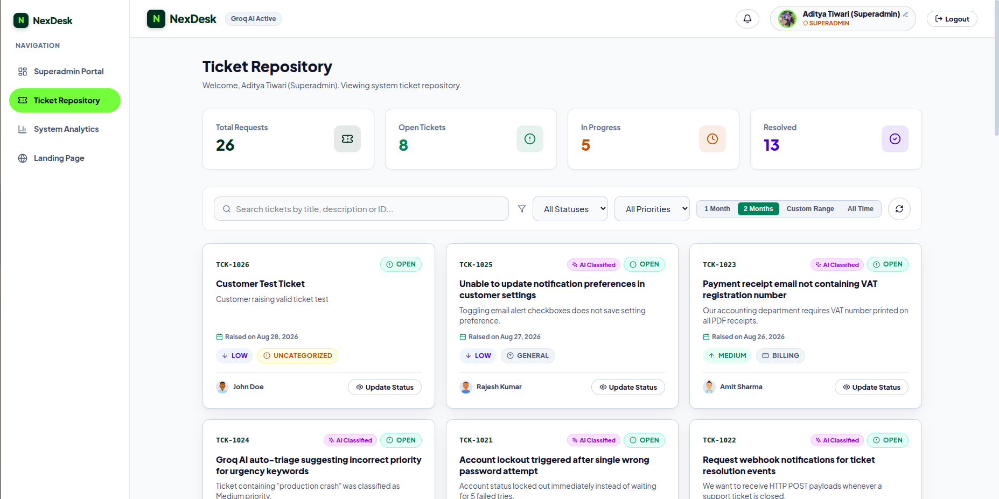

# NexDesk — AI-Powered Helpdesk & Smart Ticket Management System

> **NexDesk** is a smart MERN-stack helpdesk platform that uses Groq AI (LLM) to automatically classify, prioritize, and summarize customer support tickets in real time, featuring role-based dashboards for Customers, Support Admins, and Superadmins.

---

### Production Deployment & Public Demo Access

**Live Application URL**: **[https://nex-desk-ai-powered-ticket-manageme.vercel.app](https://nex-desk-ai-powered-ticket-manageme.vercel.app)**

*This public demonstration environment is configured for evaluators, recruiters, and reviewers to test all system features and role-based workflows.*

| Account Role | Email Address | Account Password | Granted Access & Privileges |
| :--- | :--- | :--- | :--- |
| **Superadmin** | `adityatiwari5175@gmail.com` | `Aditya@1234` | Full system governance, Admin approval/rejection cockpit, user management, and ticket control |
| **Admin** | `admin@helpdesk.com` | `Admin@1234` | Ticket status timeline management, analytics dashboard, category audit |
| **Customer** | `john.doe@example.com` | `Customer@1234` | Create support tickets with file attachments, track issue status timeline |

---

## Executive Summary & Application Screenshots

**NexDesk** is a smart MERN-stack helpdesk platform that uses **Groq AI (LLM)** to automatically classify, prioritize, and summarize customer support tickets in real time, featuring role-based dashboards for Customers, Support Admins, and Superadmins.

---

### 1. Landing Page & Authentication Portal
<kbd></kbd>

#### Explanation & Key Features:
* **Modern Announcement Bar**: Live system status badge highlighting the active AI-Powered Smart Ticket Management Engine.
* **Dual Login Options**: Single-click **Google OAuth 2.0** integration and traditional Email/Password authentication with bcrypt encryption.
* **Responsive Enterprise Design**: Sleek glassmorphism UI built with modern typography, dark mode accents, and dynamic action buttons.
* **Role-Based Login Router**: Automatically detects user role (`Superadmin`, `Admin`, `Customer`) upon login and directs to the appropriate workspace dashboard.

---

### 2. Groq AI Auto-Triage & Support Agent Assistance
<kbd></kbd>

#### Explanation & Key Features:
* **Groq Llama-3 AI Triage**: Automatically evaluates support ticket titles and descriptions to assign categories (`Technical`, `Billing`, `Account`, `Feature Request`, `General`) and calculate severity levels (`Urgent`, `High`, `Medium`, `Low`).
* **Real-time Refund & Order Verification**: AI suggestions analyze customer queries instantly to assist support engineers in verifying transaction details and refund status.
* **Automatic SLA & Urgency Warnings**: Flags urgent business-critical tickets immediately to prevent SLA breaches.

---

### 3. Automated Support Workflow & Bank-Grade Security
<kbd></kbd>

#### Explanation & Key Features:
* **End-to-End Automated Workflow**:
  1. **Submit Support Request**: Customers raise tickets with optional file attachments (images, PDFs, documents up to 5MB).
  2. **Groq AI Classification**: Groq SDK inspects issue parameters and assigns initial status, category, and priority.
  3. **Resolution & Email Alerts**: Support team updates ticket state; customers receive automated Gmail SMTP email notifications.
* **Bank-Grade Access Control (RBAC)**: Enforces strict data isolation between customer records, admin operations, and superadmin governance.
* **Bcrypt & TLS Encryption**: All credentials and session tokens are salted, hashed, and transmitted via secure protocols.

---

### 4. Superadmin Control Center & Governance Portal
<kbd></kbd>

#### Explanation & Key Features:
* **Superadmin Command Center**: Executive cockpit providing top-level metrics for Pending Admin Approvals, Approved Admin Accounts, Total Registered Customers, and Total System Tickets.
* **Admin Registration Approval Engine**: New Admin user signups default to `Pending Approval`. Superadmins can review applications, click **Approve** to grant admin rights, or click **Disapprove** with a custom reason (sent automatically via Nodemailer email).
* **User Management Directory**: Searchable user lists allowing instant role modifications and account status enforcement.

---

### 5. System Analytics Hub & Live Performance Monitoring
<kbd></kbd>

#### Explanation & Key Features:
* **Live Ticket Stream**: Real-time counter tracking total created tickets, total resolved tickets, active in-progress queue, and open ticket volumes.
* **Resolution Rate Ratio**: Visual progress bar tracking resolution throughput (e.g., 56% resolution rate).
* **Groq AI Triage Health Monitor**: Tracks AI classification coverage and provides direct access to the **Classification Audit Logs**.

---

### 6. Advanced Analytics & Visualization Suite
<kbd></kbd>

#### Explanation & Key Features:
* **Interactive Resolution Timeline**: Recharts-powered interactive chart with multi-mode display (**Bar Columns**, **Area Wave**, **Line Graph**) and time-span filters (**1D**, **7D**, **1M**, **3M**, **6M**, **1Y**, **ALL**).
* **Ticket Status Distribution**: Donut chart visualizing Resolved, In Progress, and Open ticket breakdown.
* **Priority Bottlenecks**: Vertical bar chart highlighting priority distribution across Urgent, High, Medium, and Low tickets.
* **Category Breakdown**: Horizontal distribution chart mapping tickets across Technical, Billing, Account, Feature Request, and General categories.
* **High-Res PNG Chart Download**: Export high-resolution chart images directly for executive presentation slide decks.

---

### 7. Superadmin Account Profile & AI Avatar Management
<kbd></kbd>

#### Explanation & Key Features:
* **Profile Management Modal**: Allows Superadmins and system users to update personal details, full names, and profile avatars.
* **AI Avatar Integration**: Dynamic single-click AI Avatar generator for high-definition custom avatars.
* **Account Permission Indicator**: Visual badge confirming user permission level (`SUPERADMIN`).

---

### 8. System Ticket Repository & Superadmin Overview
<kbd></kbd>

#### Explanation & Key Features:
* **Time-Bound Ticket Filtering**: Toggle ticket display using preset options (**1 Month**, **2 Months by Default**, **All Time**) or **Custom Date Range**.
* **Custom Date Range Modal**: Select specific start and end dates with full-day inclusive filtering logic (`00:00:00` to `23:59:59.999Z`).
* **Rich Ticket Cards**: Displays ticket ID, title, summary, AI Classification badge, current status, category, priority, customer avatar, creation timestamp, and quick **Update Status** trigger.

---

## Technology Stack

| Layer | Technologies & Libraries |
| :--- | :--- |
| **Frontend** | React 18, Vite, React Router v6, Axios, Recharts, Lucide React, HTML5, CSS Custom Properties |
| **Backend** | Node.js, Express.js, Mongoose, JSON Web Token (JWT), bcryptjs, Multer, Nodemailer, Groq SDK |
| **Database** | MongoDB (Local or Atlas) |
| **Artificial Intelligence** | Groq API (`llama-3.3-70b-versatile` / `mixtral-8x7b-32768`) |
| **Email Service** | Nodemailer (Gmail SMTP Transporter) |

---

## Installation & Setup Guide

### Step 1: Clone Repository
```bash
git clone <repository-url>
cd "Ticket System"
```

### Step 2: Configure Environment Variables

Create a `.env` file inside the `backend/` directory:

```env
PORT=5000
MONGODB_URI=mongodb://localhost:27017/helpdesk_db
JWT_SECRET=super_secret_jwt_key_helpdesk_2026_secure
GROQ_API_KEY=your_groq_api_key_here
GOOGLE_CLIENT_ID=your_google_client_id_here
GOOGLE_CLIENT_SECRET=your_google_client_secret_here
NODE_ENV=development
SMTP_HOST=smtp.gmail.com
SMTP_PORT=587
SMTP_USER=your_email@gmail.com
SMTP_PASS=your_app_password_here
APP_NAME=Helpdesk
CLIENT_URL=http://localhost:5173
```

### Step 3: Install Dependencies & Seed Database
```bash
# Install backend dependencies & seed test database
cd backend
npm install
npm run seed

# Install frontend dependencies
cd ../frontend
npm install
```

---

## Running the Application

### Development Mode

Run the backend server and frontend client in separate terminal windows:

**Terminal 1 (Backend Server)**:
```bash
cd backend
npm run dev
```
*Backend runs on `http://localhost:5000`*

**Terminal 2 (Frontend Client)**:
```bash
cd frontend
npm run dev
```
*Frontend runs on `http://localhost:5173`*

---

## Project Structure

```
Ticket System/
├── backend/
│   ├── src/
│   │   ├── config/          # Database configuration
│   │   ├── controllers/     # API request handlers (auth, tickets, admin, superadmin, triage)
│   │   ├── middleware/      # JWT auth, RBAC, Multer file upload
│   │   ├── models/          # Mongoose schemas (User, Ticket, Notification)
│   │   ├── routes/          # Express route definitions
│   │   ├── services/        # Groq AI SDK service, Nodemailer email service
│   │   └── server.js        # Express server entry point
│   ├── seeders/             # Database initial seeder script
│   └── uploads/             # File attachments & Website assets storage
│
├── frontend/
│   ├── src/
│   │   ├── components/      # UI Modals, Navbar, Recharts charts, CustomDateModal
│   │   ├── context/         # AuthContext, NotificationContext
│   │   ├── pages/           # LandingPage, CustomerDashboard, AdminDashboard, AdminAnalyticsPage, SuperadminDashboard
│   │   ├── services/        # Axios API client instance
│   │   └── index.css        # Global CSS design system tokens
│   └── package.json
└── README.md
```

---

## License

This project is released under the **MIT License**.
